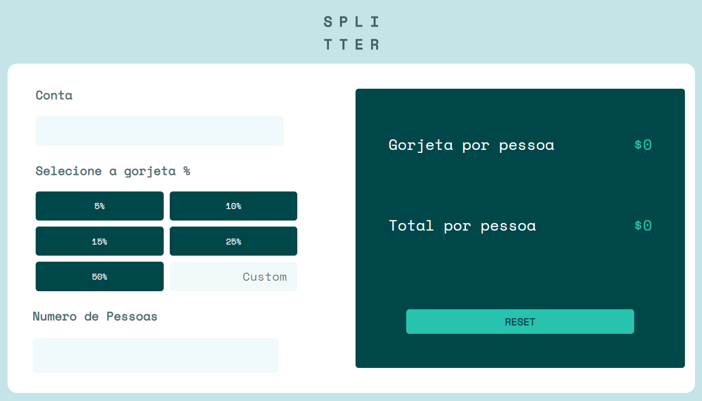

# Calculadora de gorjetas 

<a href="https://lpessolato.github.io/Calculadora-de-gorjetas/">Clique aqui para acessar</a>

## Tecnologias Utilizadas

 

## Objetivos  🎯

Calculadora feita com o intuito de estudos de JavaScript e conceitos de CSS.

## Como Utilizar 💻

O primeiro campo é para adicionar o total da conta,  o segundo para selecionar a porcentagem que será a gorjeta e por fim em quantas pessoas será dividida essa conta. As respostas virão como quanto cada pessoa dará de gorjeta e quanto cada pessoa deverá pagar no total.

